# Fundamentos y usos prácticos de Docker


[](https://atepba.org.ar/)
[](https://docker.idepba.com.ar)

## Trabajo integrador 🐳


En el presente trabajo integrador se evaluará:

- Conteinerizar una aplicación simple.
- Buildear y correr una imágen como un contenedor.
- Compartir imágenes usando Docker Hub.
- Deployar aplicaciones Docker usando multiples contenedores usando una base de datos.
- Correr la aplicación usando docker compose.

> [!IMPORTANT]  
> La fecha límite de entrega es el viernes 20/09/24.

> [!IMPORTANT]  
> El **entregable** debe un zip con un documento de texto que contenga por cada parte del trabajo integrador de la sección **[ENTREGABLE]** la info solicitada. Además en el documento debe estar la url de la imágen en Docker Hub. En el zip debe estar el archivo compose final que solo con `docker compose up` la aplicación funcione sin más. El zip debe enviarse por e-mail al instructor a la dirección que aparece al final de este documento.

---

## Respuestas


## Parte 1 - Conteinerizar una Aplicación

### 1. Obtener la aplicación

### 2. Buildear imágen

**[ENTREGABLE]:**

- Ejecute el comando correspondiente para buildear la imágen.

docker build -t mi_integradora:1.0 .    

- Elija un nombre de imágen y un tag.

mi_integradora 1.0

- Muestre cuánto espacio ocupa la imaǵen una vez creada.


- 쯇uede hacer algo para optimizar o mejorar la imágen?. Describa qué modificaciones puede hacer para optimizar la imágen.

```
# Establecemos el directorio de trabajo
WORKDIR /app

# Copiamos los archivos del proyecto al contenedor
COPY . .

# Actualizamos los paquetes e instalamos Node.js y Yarn directamente desde los repositorios oficiales
# && Instalamos las dependencias del proyecto
RUN apk add --no-cache nodejs yarn && yarn install --production
```

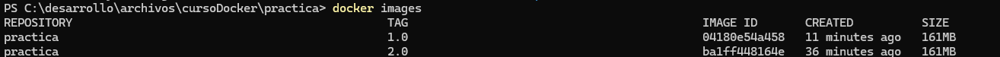

con --no-cache

docker build --no-cache -t practica:3.0 .


limpiando la cache de Yarm

```
# Usamos la imagen base de Alpine Linux
FROM alpine:latest

# Establecemos el directorio de trabajo
WORKDIR /app

# Copiamos los archivos del proyecto al contenedor
COPY . .

# Actualizamos los paquetes, instalamos Node.js y Yarn, y eliminamos la caché de Yarn después de la instalación
RUN apk add --no-cache nodejs yarn && yarn install --production && yarn cache clean

# Exponemos el puerto de la aplicación
EXPOSE 3000

# Comando por defecto para ejecutar la aplicación

CMD ["node", "src/index.js"]
```

docker build -t practica:4.0 .

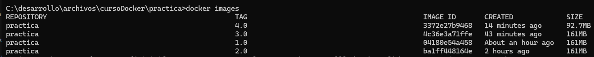

### 3. Correr la aplicación

**[ENTREGABLE]:**

- Ejecute un comando para poder correr la aplicación.

docker run -p 3000:3000 practica:5.0

- Explique el comando y cada parámetro enviado

El comando anterior permite levantar un contenedor con la imagen practica:4.0 asignando un puerto del contenendor al host, permitiendo acceder a la aplicación dentro del contenedor desde el puerto 3000 del host.

docker run: levanta un nuevo contenedor.

-p 3000:3000: Mapea el puerto 3000 del host al puerto 3000 del contenedor. 

practica:4.0: Es el nombre de la imagen (practica con tag 5.0)

- Muestre una captura de pantalla o un copy-paste del contenedor corriendo.


- Adjunte una captura de pantalla con la aplicación funcionando con la URL utilizada para acceder.

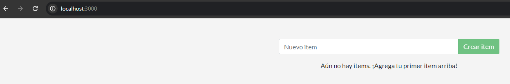


## Parte 2 - Actualizar aplicación

### 1. Actualizar el código fuente

**[ENTREGABLE]**

- Ejecutemos los comando necesarios para que la aplicación tome los cambios.

docker build -t practica:6.0 .

docker run -p 3000:3000 practica:6.0

- Realice un etiquetado coherente respecto a los cambios en la imágen.
- Mostrar captura de pantalla con la app corriendo.


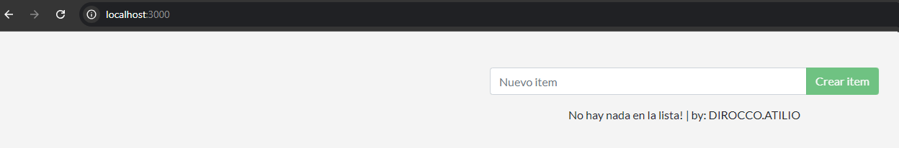

### 2. Elimine el contenedor e imágen anterior

**[ENTREGABLE]:**

- Elimine la imágen y el contenedor hecho en el punto anterior: Mostrar comandos utilizados.

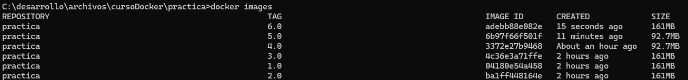

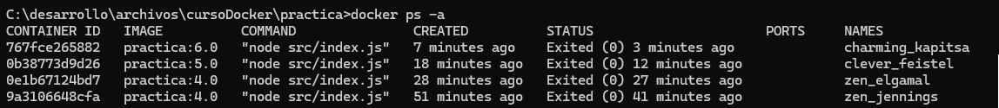

Se eliminará practica:6.0

Eliminación de contenedor:

docker rm 767f

Eliminación de imagen:

docker rmi adeb

- Liste las imágenes y contenedores para ver que ya no existen.

docker images

docker ps -a

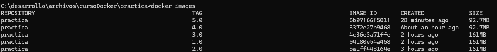

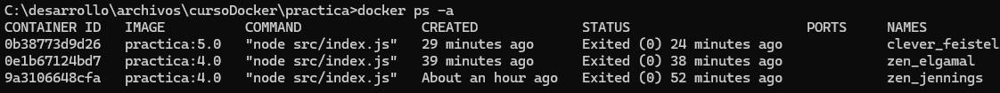

## Parte 3 - Compartir app

**[ENTREGABLE]:**

- Adjunte los comandos necesarios para que sea posible subir la imaǵen correctamente.

docker tag practica:7.0 ajdirocco/practica:7.0

docker login

docker push ajdirocco/practica:7.0

- Comparta la URL para que pueda ser posible probar y descargar su imágen.
  
https://hub.docker.com/repository/docker/ajdirocco/practica

docker pull ajdirocco/practica:7.0

- Agregue un _overview_ para el repositorio de Dockerhub con instrucciones para correr la imágen y todo lo que considere necesario para que un tercero pueda ejecutar la imágen.


## Parte 4 - Persistencia de datos

**[ENTREGABLE]**

- Realice los cambios necesarios para que sea posible persistir los datos.

Creo la carpeta que contendra la persistencia de la base de datos

mkdir bm_db

Me posiciono dentro de la carpeta

cd bm_db

- Adjunte los comandos utilizados con la explicación correspondiente.

Monto dicha carpeta en el contenedor

C:\desarrollo\archivos\cursoDocker\practica\bm_db>docker run -p 3000:3000 -v.:/etc/todos practica:7.0

- Decida que tipo de persistencia es la adecuada para la app.

Me decidi por ***Binds Mount*** porque me parecio muy sencillo luego poder hacer una copia de la base desde el mismo explorador del host (en mi caso un Winbdows) y porque es facil ver que dicho archivo cambio:


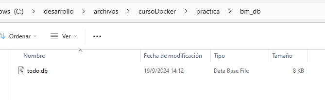

## Parte 5 - Aplicaciones multicontainer

#### Redes en contenedores

#### Base de datos

#### Conectar APP a base de datos

**Teniendo todo esto en cuenta [ENTREGABLE]:**

- [Crear una red](https://docker.idepba.com.ar/clase4.html#/network_create) para conexión entre los contenedores que servirá también para conectar a la aplicación.
- [Crear un nuevo volumen](https://docker.idepba.com.ar/clase4.html#/volume_create)para persistir los datos de la base MySQL. El path donde se almacenan los datos en el contenedor MySQL es `/var/lib/mysql`.
- Iniciar el contenedor de base de datos utilizando el comando `docker run` y enviando las variables de entorno listadas.
- Iniciar el contenedor de la aplicación utilizando el comando `docker run` enviando las variables de entornos necesarias para la conexión con la base de datos.

Creacion de la red:

docker network create net-todo

Creacion del contenedor de la base y la generacion automatica del volume (sql_data):

docker run --network net-todo --network-alias mysql -v sql_data:/var/lib/mysql -e MYSQL_ROOT_PASSWORD=holapass -e MYSQL_DATABASE=todo mysql:8.0

Prueba del contenedor de base de datos:

C:\desarrollo\archivos\cursoDocker\practica> docker exec -it dcd7 mysql -u root -p

Ya dentro de mysql:

SHOW DATABASES;

exit

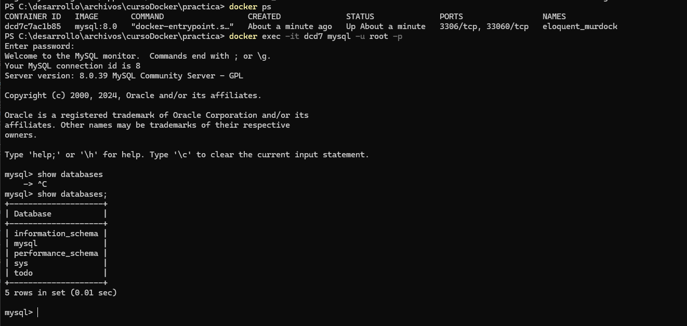

Levantar el contenedor de la app pasandole las variables de entorno para la base de datos:

docker run -p 3000:3000 --network net-todo -e MYSQL_HOST=mysql -e MYSQL_USER=root -e MYSQL_PASSWORD=holapass -e MYSQL_DB=todo practica:7.0

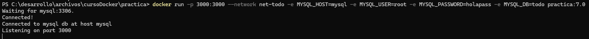

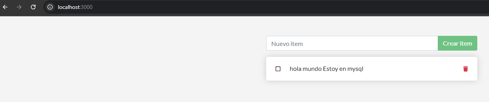

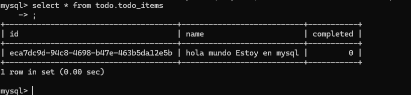

### Parte 6 - Utilizando Docker Compose

Llegando a este punto y habiendo completado cada punto ya tiene la información necesaria para volcarla en un archivo de Docker Compose para simplificar la ejecución de los contenedores.

#### Cree el archivo de Docker Compose

En la carpeta raíz del proyecto, cree un archivo de docker compose `compose.yml` o `docker-compose.yml`.

> [!TIP]
> Puede ser de utilidad el sitio [composerize](https://www.composerize.com/).

> [!NOTE]  
> Teniendo en cuenta que la aplicación necesitará que la base de datos esté previamente iniciada, utilice los elementos de compose para explicitar dicha dependencia.

#### Corra los contenedores

Con el siguiente comando debería ser capaz de correr la aplicación junto con la base de datos

```
docker compose up -d:
```

Prueba de docker compose up -d

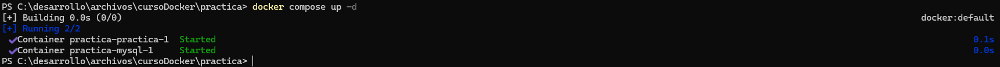

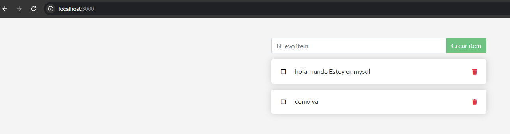

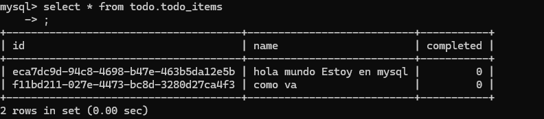


#### Imagen de docker hub

Cambie la imágen del `docker compose` para que tome como origen la imágen que ha subido a Docker Hub con su usuario.

image: ajdirocco/practica:7.0

## Referencias:

- [Curso](https://docker.idepba.com.ar/#/indice)

- [Laboratorios](https://github.com/kity-linuxero/docker_410_practicas/tree/main)

- [Practica Integradora (original de este Readme)](https://github.com/kity-linuxero/docker-integradora?tab=readme-ov-file#fundamentos-y-usos-pr%C3%A1cticos-de-docker)

- [Docker Docs: Docker Workshop](https://docs.docker.com/get-started/workshop/)

----
Centro de Formación CFL 410 - Omar Nuñez

IDEP | Instituto de Estudios sobre Estado y Participación

Instructor: Cristian O. Giambruni | e-mail: cgiambruni@gmail.com | IDEP Informática


